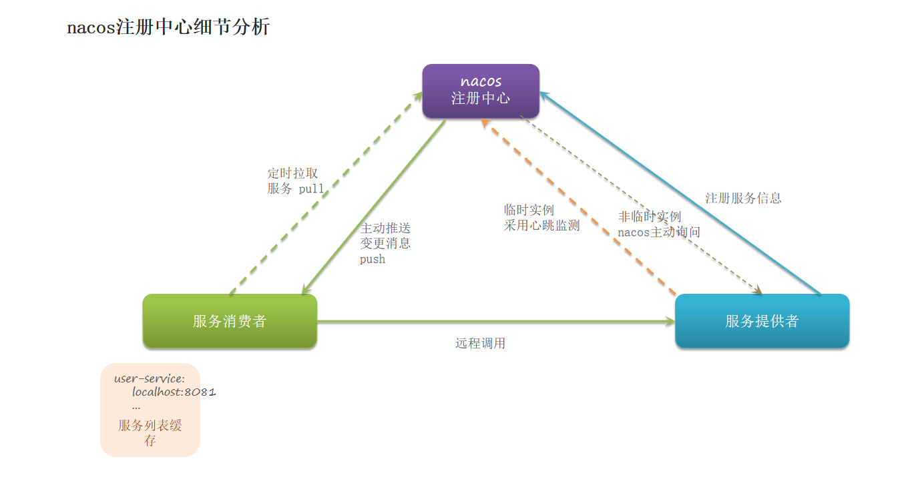

#### Nacos实例的两种分类
Nacos的服务实例注册分为临时实例和非临时实例两种方式，它们之间的区别在于实例的心跳维护方式和生命周期。
非临时实例：在服务实例启动时，将自己注册到Nacos服务端，并且携带一个心跳时间周期，默认值为90秒。之后服务实例会定时向Nacos服务端发送心跳请求，以告诉Nacos自己还存在并保持持续的活性。当服务实例出现异常或者关闭时，会通过发送注销请求来通知Nacos服务端，随后该实例的状态会被标记为DOWN或者OUT_OF_SERVICE状态，并保留在服务列表中。
非临时实例的生命周期与服务提供者的生命周期相同，在服务提供者关闭时，该实例会被标记为DOWN或OUT_OF_SERVICE状态，并保留在服务列表中，直到服务重新启动或者被手动注销。
临时实例：临时实例与非临时实例最大的区别在于，服务实例启动时只向Nacos服务端发送注册请求，但不再发送心跳请求。当服务实例下线、关闭或崩溃时，Nacos服务端会通过监听心跳超时事件来自动将该实例的状态标记为DOWN或OUT_OF_SERVICE，并从服务列表中移除该实例。
临时实例的生命周期较短，它适用于生命周期短的服务，它主要的应用场景是一些短期任务或者需要频繁启动停止的任务。
总之，Nacos可以通过临时实例和非临时实例两种方式进行服务实例注册，由此实现服务实例的注册中心管理。根据业务需求，选择不同的注册方式，以达到更好的服务治理效果

#### Nacos集群默认采用AP方式
##### AP方式
当Nacos集群中的某个节点收到客户端的修改请求时，它会将这个请求的修改操作在本地进行修改，并异步将修改操作发送给其他节点。但是，在这个修改操作被所有节点都同步之前，有可能某些节点看到了修改前的数据，而另外一些节点却已经看到了修改后的数据。这种情况就是“不一致性”。
以服务注册为例，假设有一个Nacos集群，包括三个节点：A、B和C。客户端向节点A发起服务注册请求，节点A将请求进行了修改并异步复制给了节点B和节点C。然后，由于网络故障，节点B和节点C无法接收到节点A的修改请求。此时，节点A的数据已经更新，但节点B和节点C中的数据还是旧的，就出现了“不一致性”。
需要强调的是，虽然Nacos默认采用AP方式，但这种不一致性只是短暂的，在一定时间内节点之间数据会逐渐同步，最终达到一致。因此，在大多数场景下，这种短暂的不一致性不会对系统的稳定性和正确性造成很大的影响。
##### CP方式
相比于AP方式，CP模式更加侧重数据的一致性。在Nacos集群中，如果将其配置为CP模式，那么服务注册、配置管理等操作将变得更为严格，只有当所有节点都确认了某个操作后，其他节点才能继续进行处理。
具体来说，在CP模式下，当客户端发起某项修改操作时，该操作会先在主节点上进行处理，并同步更新到其他节点。其他节点会等待主节点通知更新完成后才会执行相应的操作，确保集群中的数据是强一致性的。
需要注意的是，将Nacos集群配置为CP模式可能会影响其可用性，因为一个节点的失效可能会导致整个集群的不可用。因此，对于对数据一致性要求非常高的场景，可以考虑采用CP模式，但需要权衡可用性和一致性之间的关系。
总而言之，CP方式注重数据的一致性，对于对一致性要求较高的业务场景比较适合，但需要在可用性和一致性之间进行平衡。